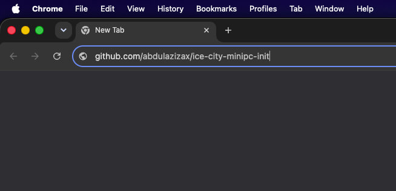
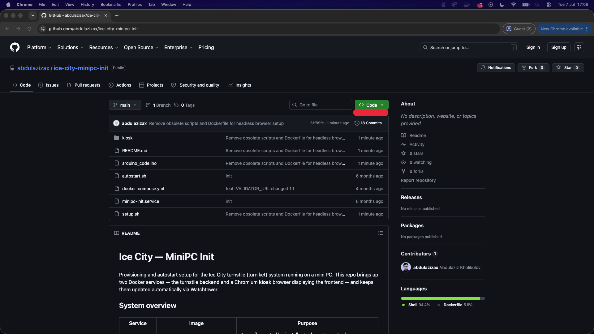
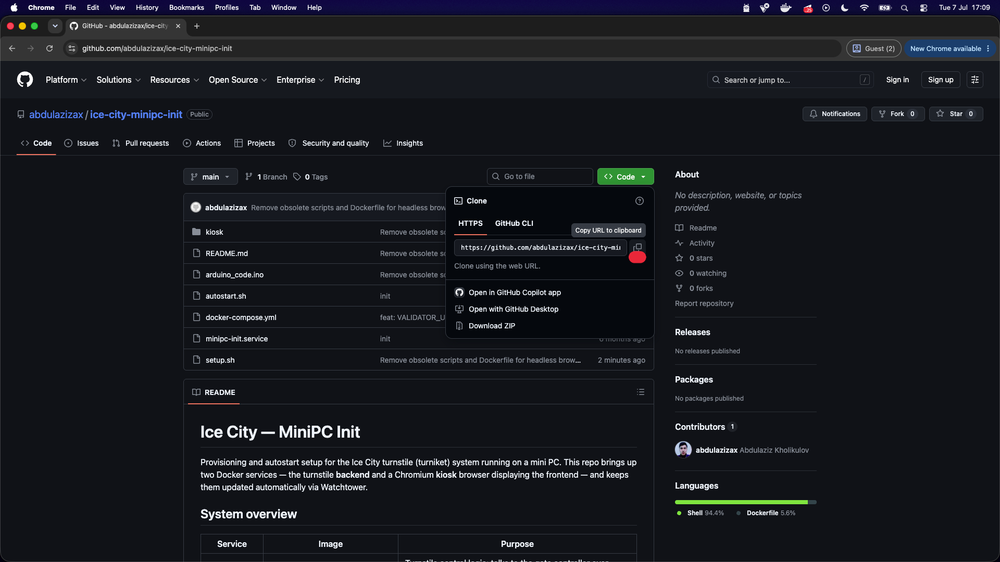
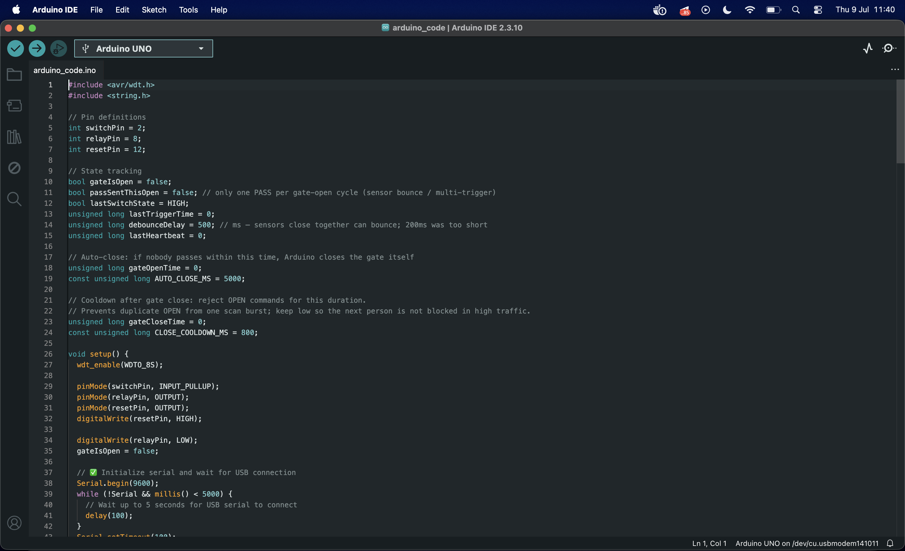
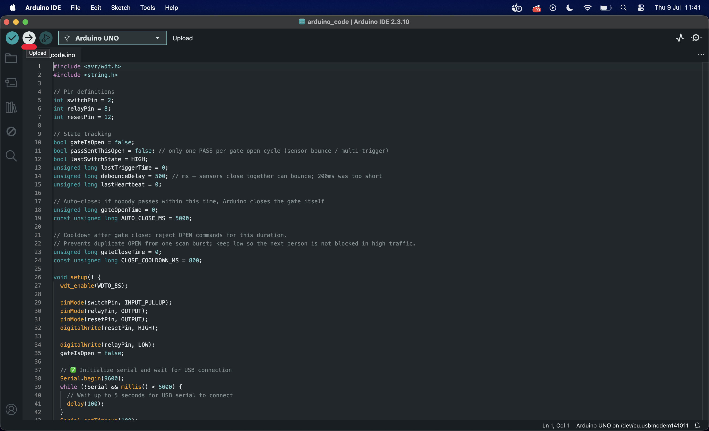
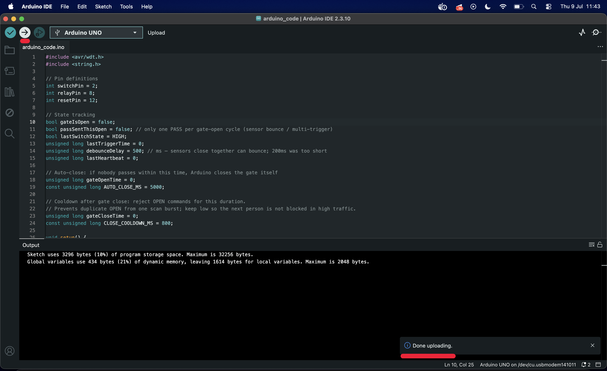

# Ice City — Turnstile Mini PC Setup

Step-by-step guide to set up the mini PC that runs the Ice City turnstile (turniket).

## 1. Install the OS
Install **Xubuntu 22.04 (Jammy)** on the mini PC.

- Video tutorial: https://youtu.be/suYEf1ERnP4?si=ra14UM0DLsXk9Ain
- Download (ISO): https://cdimage.ubuntu.com/xubuntu/releases/jammy/release/xubuntu-22.04.5-desktop-amd64.iso
- All releases: https://cdimage.ubuntu.com/xubuntu/releases/jammy/release/

## 2. Configure a static IP
Connect the mini PC to the turnstile network and give it a **free, unused IP** on the `192.168.7.0/24` subnet:

```
Gateway: 192.168.7.10
Mask:    24
Internet: 8.8.8.8
```

## 3. Reboot
Reboot the mini PC so the static IP takes effect.

## 4. Check the internet
```bash
ping 8.8.8.8
```

## 5. Update the system
```bash
sudo apt update && sudo apt upgrade
```

## 6. Install Git
```bash
sudo apt install git
```

## 7. Create a folder and go into it
```bash
mkdir icecity && cd icecity
```

## 8. Clone the project
Open the repository in a browser:



Click the green **Code** button:



Copy the URL:



Then clone it with the copied URL:

```bash
git clone <paste-the-copied-url-here> .
```

## 9. Run the setup script
```bash
sudo chmod +x setup.sh
sudo ./setup.sh
```

## 10. Reboot again
So everything the setup script installed takes effect.

## 11. Start the turnstile
Go back into the project folder and run:

```bash
docker compose pull && docker compose up -d
```

## 12. Done
The turnstile is now running.

---

## Arduino setup

The turnstile gate is controlled by an Arduino running [`arduino_code/arduino_code.ino`](arduino_code/arduino_code.ino).

### Uploading the sketch

1. Install the [Arduino IDE](https://www.arduino.cc/en/software) and open `arduino_code/arduino_code.ino`.
2. Connect the Arduino to your laptop with a USB cable.
3. Go to **Tools → Board** and select your Arduino model. Then go to **Tools → Port** and select the port the Arduino is connected to (shown at the bottom of the window).

   

4. Click the **Upload** (→) button.

   

5. Wait until you see **"Done uploading"**.

   

### Wiring

**Relay:**
1. Relay `IN` → Arduino pin `8`
2. Relay `GND` → Arduino power `GND`
3. Relay `VCC` → Arduino power `5V`

**USB-TTL:**
1. USB-TTL `GND` → Arduino power `GND`
2. USB-TTL `RXD` → Arduino `TX`
3. USB-TTL `TXD` → Arduino `RX`
4. USB-TTL `5V` → Arduino analog in `Vin`

Now connect the Arduino to the mini PC with a USB cable — it will be detected automatically.
